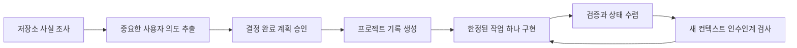

# Manage Project Intent

[](LICENSE)

**Codex를 위한 의도 보존형 프로젝트 운영 Skill입니다.**

Manage Project Intent는 채팅 기록이 아니라 저장소의 문서와 실제 증거에서 프로젝트를 이어가게 합니다. 구현 전에 중요한 사용자 의도를 질문으로 추출하고, 제품 계약과 현재 구현 상태를 분리하며, 결정 이유와 정확히 하나의 다음 작업을 보존합니다.

[English](README.md)

## 왜 필요한가요?

AI는 코드를 만들 수 있지만 사용자가 무엇을 중요하게 생각하는지는 처음부터 알지 못합니다. 다음과 같은 정보는 대화 속에만 남기 쉽습니다.

- 누구를 위한 제품이고 성공을 어떻게 판단하는지
- UX, 안전, 개인정보, 사업 조건이 충돌할 때 무엇을 우선하는지
- 사용자가 더 단순해 보이는 선택을 거절한 이유
- 실제로 구현된 것과 계획만 된 것의 차이
- 다음 세션이 무엇을 해야 하고 완료를 어떻게 검증해야 하는지

이 정보가 사라지면 다음 에이전트는 같은 질문을 반복하고, 범위를 임의로 넓히고, 오래된 체크박스를 믿거나, 의도적으로 남긴 제약을 불필요한 복잡성으로 오해할 수 있습니다. 이 Skill은 구현 전에 암묵적인 판단을 저장소에 남는 프로젝트 기록으로 바꿉니다.

## 만든 의도

출발점은 단순합니다. 모두가 비슷한 AI 도구를 사용할 수 있다면 실제 결과를 구분하는 것은 도구에 전달되는 사람의 의도입니다. 그래서 이 workflow는 에이전트가 스스로 정할 수 있는 낮은 수준의 구현 방식보다 목표, 가치, 직접 개입, 타협 기준을 질문합니다.

목표는 문서를 많이 만드는 것이 아닙니다. 새로운 에이전트가 오래된 채팅을 다시 읽지 않고도 같은 의도 아래 프로젝트를 이어갈 만큼의 정보와 증거를 보존하는 것입니다.

## 기대할 수 있는 효과

- **요구사항 재질문 감소:** 중요한 답이 저장소에 남습니다.
- **범위 통제:** Full, Delta, Lite 작업에 서로 다른 엄격도를 적용합니다.
- **결정의 연속성:** 거절한 대안과 사용자의 직접 개입 이유가 보존됩니다.
- **안전한 변경:** 제품, UX, 안전, 개인정보, 데이터 제약이 명시됩니다.
- **정직한 상태 추적:** 로드맵의 낙관이 아니라 코드와 테스트로 현재 상태를 판단합니다.
- **세션 독립 인수인계:** 다음 작업 하나에 수용 조건과 검증 방법이 붙습니다.
- **드리프트 탐지:** 목표와 구현의 충돌을 조용히 덮지 않고 기록합니다.

이것은 의도한 운영 효과이지 생산성이나 소프트웨어 품질을 자동으로 보장한다는 뜻은 아닙니다. 문서를 구현과 함께 최신 상태로 유지해야 하는 비용이 있으며, 관리되지 않은 문서는 오히려 잘못된 확신을 줄 수 있습니다. 그래서 Lite 작업에는 불필요한 문서 갱신을 강요하지 않습니다.

## 작동 방식



### 네 개의 정식 문서

| 질문 | 원본 문서 |
| --- | --- |
| 제품이 무엇을 해야 하는가? | `PRODUCT_SPEC.md` |
| 어떤 순서로 만들어야 하는가? | `ROADMAP.md` |
| 무엇이 구현·검증·차단됐고 다음 작업은 무엇인가? | `PROJECT_STATUS.md` |
| 중요한 선택을 왜 했는가? | `DECISION_LOG.md` |

현재 존재하는 동작의 최종 진실은 코드, 테스트, 실행 결과입니다. 구현과 문서가 충돌하면 편한 쪽을 정답으로 고르지 않고 드리프트로 기록합니다.

### 작업 등급

| 등급 | 적용 대상 | 동작 |
| --- | --- | --- |
| **Full** | 새 제품, 다중 마일스톤, 아키텍처, 안전·개인정보·데이터·라이선스·가격 결정 | 조사, 반복 인터뷰, 계획 승인, 관련 문서, 새 컨텍스트 인수인계 검증 |
| **Delta** | 승인된 제품 계약 안의 한정된 사용자 기능 | 필요한 질문과 영향받는 문서만 갱신 |
| **Lite** | 내부 버그, 리팩터링, 빌드·도구 작업 | 짧은 계획과 최소한의 영구 문서 변경 |

## 설치

Codex 대화에서 다음과 같이 요청합니다.

```text
$skill-installer Install manage-project-intent from https://github.com/seolbbb/manage-project-intent/tree/main/skills/manage-project-intent
```

설치된 Skill은 다음 턴부터 사용할 수 있습니다. 공식 installer는 이미 존재하는 Skill 폴더를 자동으로 덮어쓰지 않습니다.

관리할 저장소를 현재 Codex workspace로 열거나 첫 요청에 저장소 경로를 명시하세요. 정식 문서는 기본적으로 `docs/` 아래에 생성됩니다. 기존 3문서 프로젝트는 `PRODUCT_SPEC.md`, `PROJECT_STATUS.md`, `DECISION_LOG.md`를 뜻하며, 4문서 계약은 여기에 `ROADMAP.md`를 추가합니다.

설치 확인은 새 턴에서 `$manage-project-intent`를 호출하면 됩니다. 발견되지 않으면 Codex를 다시 시작하세요. `$skill-installer`는 기존 설치를 덮어쓰지 않으므로 업데이트하려면 `$CODEX_HOME/skills/manage-project-intent`를 검토한 뒤 이름을 바꾸거나 제거하고 다시 설치해야 합니다.

## 사용법

명시적으로 호출하는 방법이 가장 분명합니다.

```text
$manage-project-intent 새 로컬 우선 사진 정리 프로젝트를 시작해줘
$manage-project-intent 계정 삭제와 데이터 보존 기능을 계획해줘
$manage-project-intent status
$manage-project-intent continue
$manage-project-intent 분석 이벤트 저장 결정을 변경하고 싶어
$manage-project-intent 문서와 실제 저장소를 audit해줘
```

- `start` — 새 프로젝트를 조사하고 Full 인터뷰를 시작합니다.
- `plan` — 작업 등급을 정하고 결정 완료 계획을 만듭니다.
- `status` — 파일을 바꾸지 않고 문서와 저장소 증거를 비교합니다.
- `continue` — 문서에 있는 단 하나의 Next task만 작업 범위로 채택합니다.
- `revise` — 기존 결정을 변경할 영향을 분석하고 과거 근거를 보존합니다.
- `audit` — 드리프트, 오래된 증거, 블로커와 인수인계 품질을 읽기 전용으로 검사합니다.

관리용 `AGENTS.md` 마커나 기존 3~4개 프로젝트 문서가 있는 저장소에서는 자연어 요청만으로 선택될 수도 있습니다. 번역, 단순 질문, 사소한 수정이나 관련 없는 일회성 작업에는 암묵적으로 개입하지 않도록 설계되어 있습니다.

정확한 opt-in 마커는 Skill에 포함된 [`AGENTS-snippet.md`](skills/manage-project-intent/assets/templates/AGENTS-snippet.md)에서 확인할 수 있습니다.

## Decision Log는 일반 ADR보다 넓습니다

일반적인 ADR은 기술 선택의 이유를 기록합니다. 이 workflow는 중요한 사용자 개입도 함께 기록합니다.

> 사용자는 되돌릴 수 없는 실수를 막는 것이 확인 단계 하나를 줄이는 것보다 중요하다고 판단해 자동 삭제를 거절했다.

다음 에이전트는 추가 확인이 우연한 복잡성이 아니라 보호해야 할 제품 결정임을 알 수 있습니다. 결정을 바꾸면 과거 기록을 고치지 않고 새 `DEC-###`을 추가해 양방향 supersede 관계를 남깁니다.

## 새 컨텍스트 Goldfish 검증

Full 작업이 끝나면 대화 이력을 모르는 새 에이전트가 저장소와 네 문서만 보고 다음을 복원해야 합니다.

1. 제품 목표, 대상 사용자와 근본 의도
2. 우선 가치와 사용자의 직접 개입
3. 구현된 범위와 바꾸면 안 되는 제약
4. 정확히 하나의 다음 작업
5. 완료 판정에 필요한 증거

원래 대화에서 이미 답한 중요한 질문을 다시 묻는다면 인수인계 문서가 부족한 것입니다. 정확한 기준은 [lifecycle contract](skills/manage-project-intent/references/lifecycle.md)에 있습니다.

## GitHub Spec Kit과의 관계

[GitHub Spec Kit](https://github.com/github/spec-kit)은 기능 단위 명세와 구현 workflow입니다. Manage Project Intent는 그보다 한 단계 위에서 장기 제품 의도와 프로젝트의 현재 상태를 관리합니다.

| | Spec Kit | Manage Project Intent |
| --- | --- | --- |
| 주된 단위 | 기능 명세와 구현 | 장기 제품 의도와 프로젝트 연속성 |
| 핵심 관심사 | 명세, 명확화, 계획, 작업, 구현 | 의도, 제품 계약, 로드맵, 관찰된 상태, 결정 근거 |
| 현재 상태 | 주로 기능 산출물에서 판단 | 실제 저장소 증거와 명시적으로 비교 |
| 인수인계 | 기능 산출물에서 계속 | 검증 가능한 Next task 하나와 보호 결정에서 계속 |

`.specify/` 또는 `$speckit-*` Skill이 있으면 선택한 로드맵 작업 하나를 Spec Kit으로 실행한 뒤 확정된 결과를 네 정식 문서로 다시 합칠 수 있습니다. Spec Kit은 필수가 아닙니다.

## 포함된 검증

- bootstrap, migration 안전성과 문서 의미 검사를 위한 결정적 테스트
- Full, Delta, Lite, status/audit, continue, revise, Spec Kit 경계와 인수인계 행동 사례
- 질문 품질, 읽기 전용 동작과 문서 복원을 확인하는 fresh-agent 평가
- 개인 프로젝트 정보를 포함하지 않는 real-world project backtest

행동 사례는 [`cases.json`](skills/manage-project-intent/tests/evals/cases.json)에서 볼 수 있습니다. 모든 fresh-agent 실행의 완전 자동화는 후속 개선 대상입니다.

## 기여와 라이선스

Issue와 Pull Request를 환영합니다. 공개 보고에는 개인 프로젝트명, 로컬 경로, 원본 데이터, 자격 증명이나 채팅 원문을 포함하지 마세요.

[MIT License](LICENSE)
