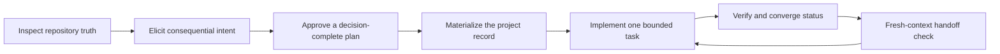

# Manage Project Intent

[](LICENSE)

**An intent-preserving project workflow for Codex.**

Manage Project Intent makes an AI-assisted software project resumable from repository evidence instead of chat history. It investigates before asking, extracts consequential human intent, separates the product contract from implementation status, preserves why decisions were made, and leaves exactly one verified next task.

[한국어 문서](README.ko.md)

## Why use it?

AI can generate code, but it does not automatically know which tradeoffs matter to you. Important context is often left in a conversation:

- who the product is for and what success means;
- which UX, safety, privacy, or commercial tradeoffs are non-negotiable;
- why a human rejected a seemingly simpler option;
- what is actually implemented versus merely planned;
- what the next session should do and how completion will be verified.

When that context disappears, a later agent may repeat questions, expand scope, trust stale checkboxes, or "simplify" a deliberate constraint away. This Skill turns those tacit choices into a durable project record before implementation begins.

## The developer intent

The starting belief is simple: when everyone has access to similar AI tools, the meaningful difference is the human intent supplied to them. The workflow therefore asks about outcomes, values, interventions, and tradeoffs—not low-level mechanics the agent can safely determine itself.

The goal is not to produce more documents. The goal is to preserve enough intent and evidence that a fresh agent can continue the same project without reconstructing its purpose from old chat logs.

## What it is designed to improve

- **Fewer repeated requirement questions:** consequential answers live in the repository.
- **Clearer scope control:** Full, Delta, and Lite work receive different levels of ceremony.
- **Decision continuity:** rejected alternatives and human interventions remain visible.
- **Safer change:** product, UX, safety, privacy, and data constraints are explicit.
- **Honest status:** current behavior comes from code and tests, not roadmap optimism.
- **Session-independent handoff:** one concrete next task includes acceptance and verification.
- **Drift detection:** contradictions between intended and observed behavior are recorded instead of silently reconciled.

These are intended operational benefits, not a guarantee of higher productivity or better software. The workflow has a maintenance cost: documents must be updated alongside implementation, and poorly maintained records can create false confidence. Lite work deliberately avoids unnecessary document churn.

## How it works



### Four canonical documents

| Question | Source of truth |
| --- | --- |
| What should the product do? | `PRODUCT_SPEC.md` |
| In what order should it be delivered? | `ROADMAP.md` |
| What is implemented, verified, blocked, or next? | `PROJECT_STATUS.md` |
| Why was a consequential choice made? | `DECISION_LOG.md` |

Code, tests, and observed runtime behavior remain the final truth for what exists now. If implementation and documents disagree, the Skill records drift rather than choosing a convenient answer.

## See the workflow applied to this repository

These are the live documents used to build and maintain this Skill—not polished example templates. They expose the actual product intent, current status, roadmap, verification evidence, and decision history behind the repository.

| Document | English | Korean canonical source |
| --- | --- | --- |
| Product contract | [PRODUCT_SPEC.md](docs/en/PRODUCT_SPEC.md) | [PRODUCT_SPEC.md](docs/PRODUCT_SPEC.md) |
| Current status and one Next task | [PROJECT_STATUS.md](docs/en/PROJECT_STATUS.md) | [PROJECT_STATUS.md](docs/PROJECT_STATUS.md) |
| Delivery sequence | [ROADMAP.md](docs/en/ROADMAP.md) | [ROADMAP.md](docs/ROADMAP.md) |
| User interventions and rationale | [DECISION_LOG.md](docs/en/DECISION_LOG.md) | [DECISION_LOG.md](docs/DECISION_LOG.md) |

The Korean files are the working source of truth for this repository. The English mirrors preserve the same identifiers, states, decisions, and evidence for public readers.

### Work levels

| Level | Use it for | Behavior |
| --- | --- | --- |
| **Full** | New products, multi-milestone features, architecture changes, safety/privacy/data/licensing/pricing decisions | Research, repeated intent interview, explicit plan approval, all affected documents, and fresh-context handoff validation |
| **Delta** | A bounded user-facing feature inside an accepted product contract | Targeted questions and only the affected documents |
| **Lite** | Internal fixes, refactors, build or tooling work | Concise planning and minimal permanent document churn |

## Install

In a Codex prompt, run:

```text
$skill-installer Install manage-project-intent from https://github.com/seolbbb/manage-project-intent/tree/main/skills/manage-project-intent
```

The Skill is available from the next turn. The installer intentionally refuses to overwrite an existing Skill directory.

Open the repository you want to manage as the current Codex workspace, or name its path in your first prompt. The Skill creates canonical files under `docs/` by default. A legacy three-document project means `PRODUCT_SPEC.md`, `PROJECT_STATUS.md`, and `DECISION_LOG.md`; the four-document contract adds `ROADMAP.md`.

To verify installation, start a new turn and invoke `$manage-project-intent`. Restart Codex if the Skill is not discovered. Updating requires reviewing and renaming or removing the existing `$CODEX_HOME/skills/manage-project-intent` folder before reinstalling, because `$skill-installer` does not overwrite it.

## Use

Explicit invocation is the clearest entry point:

```text
$manage-project-intent start a new local-first photo organizer
$manage-project-intent plan account deletion and data retention
$manage-project-intent status
$manage-project-intent continue
$manage-project-intent revise the decision to store analytics events
$manage-project-intent audit the docs against the repository
```

The intents also work in natural language:

- `start` — investigate a new project and begin the Full interview.
- `plan` — classify the work and make a decision-complete plan.
- `status` — compare documents and repository evidence without changing files.
- `continue` — adopt the single documented Next task as the full scope.
- `revise` — analyze a changed decision and preserve the superseded rationale.
- `audit` — report drift, stale evidence, blockers, and handoff quality read-only.

The Skill may also activate when a repository contains its managed `AGENTS.md` marker or an existing three- or four-document project record. It is designed not to activate implicitly for translations, isolated questions, trivial fixes, or unrelated one-off work.

The exact opt-in marker is available in the bundled [`AGENTS-snippet.md`](skills/manage-project-intent/assets/templates/AGENTS-snippet.md).

## Decision Log: more than an ADR

A conventional architecture decision record often explains why one technology was chosen over another. This workflow also records consequential human intervention:

> The user rejected automatic deletion because preventing irreversible mistakes matters more than removing one confirmation step.

That rationale warns a future agent that the extra confirmation is a protected product choice, not accidental complexity. A changed decision is added as a new `DEC-###` entry with a bidirectional supersede relationship; history is not rewritten.

## Fresh-context (Goldfish) validation

Full work ends with a fresh agent receiving only the repository and canonical documents. It must reconstruct:

1. the product goal, audience, and underlying intent;
2. the user's priority values and direct interventions;
3. the implemented scope and protected constraints;
4. exactly one next task;
5. the evidence required to call that task complete.

If it asks an important question already answered in the original conversation, the handoff record is incomplete. See the [lifecycle contract](skills/manage-project-intent/references/lifecycle.md) for the exact gate.

## Relationship to GitHub Spec Kit

[GitHub Spec Kit](https://github.com/github/spec-kit) is a strong feature-level specification and implementation workflow. Manage Project Intent operates one level above it:

| | Spec Kit | Manage Project Intent |
| --- | --- | --- |
| Primary unit | A feature specification and its implementation | Long-lived product intent and project continuity |
| Core concern | Specify, clarify, plan, task, implement | Intent, product contract, roadmap, observed status, decision rationale |
| Current status | Usually inferred from feature artifacts | Explicitly compared with repository evidence |
| Handoff | Continue from feature artifacts | Continue from one verified Next task and protected decisions |

When `.specify/` or `$speckit-*` Skills are present, Manage Project Intent can route one selected roadmap task through Spec Kit and then merge durable outcomes back into the four canonical documents. Spec Kit is optional.

## Verification included in this repository

- deterministic tests for bootstrap, migration safety, and validation semantics;
- behavioral cases for Full, Delta, Lite, status/audit, continue, revise, Spec Kit boundaries, and handoff;
- fresh-agent forward tests that check questions, read-only behavior, and document reconstruction;
- an anonymized real-world project backtest;

The behavior cases are inspectable in [`cases.json`](skills/manage-project-intent/tests/evals/cases.json). They are specifications today; automating every fresh-agent execution is a planned improvement.

## Contributing

Issues and pull requests are welcome. Do not include private project names, local paths, source data, credentials, or chat excerpts in public reports.

## License

[MIT](LICENSE)
